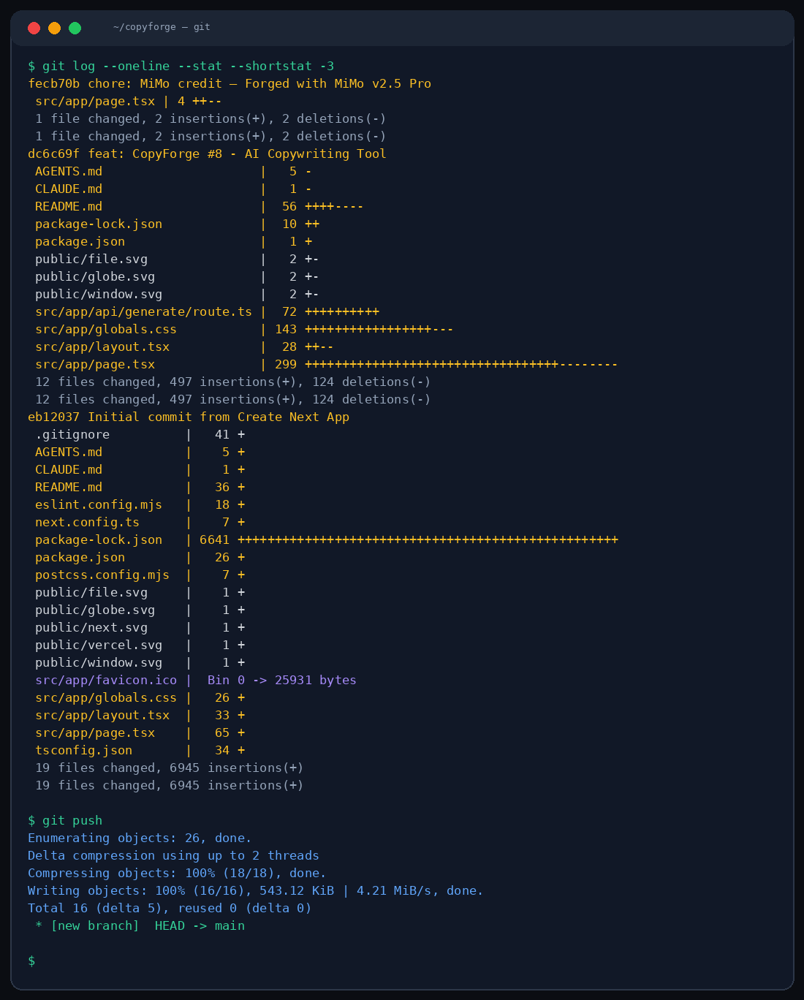

# 🔥 CopyForge

Generate high-converting marketing copy for landing pages, ads, product descriptions, emails, and social posts. Just describe your product, pick a tone, and let MiMo handle the rest.



## What it does

CopyForge is a marketing copy generator built for speed. Type in your product name, add a short description, select your copy type and tone — and get polished, conversion-ready copy in seconds.

**Copy types supported:**
- Landing page hero sections & CTAs
- Social media ad copy (Facebook, Instagram, Google)
- Product descriptions for e-commerce
- Marketing email sequences
- Social media post captions

## How it works

1. Enter your product/service name
2. Write a brief description
3. Pick a copy type (landing, ads, product, email, social)
4. Choose your tone (professional, casual, bold, playful)
5. Hit generate — get structured copy with headers, body, and CTA

## Quick start

```bash
npm install
cp .env.example .env.local
npm run dev
```

## Environment

```env
MIMO_API_URL=http://localhost:19911/v1/chat/completions
MIMO_API_KEY=your_key_here
```

## Stack

- **Next.js 16** — App Router, server components
- **Tailwind CSS 4** — Utility-first styling
- **TypeScript** — End-to-end type safety
- **MiMo v2.5 Pro** — AI copywriting engine

## Theme

Dark editor aesthetic. Deep charcoal backgrounds, crimson accents, monospace inputs. Designed to feel like a pro writing tool, not a toy.

## File layout

```
src/app/
├── api/generate/route.ts   ← MiMo API proxy
├── page.tsx                ← Main UI with 2-panel layout
├── globals.css             ← Dark theme variables
└── layout.tsx              ← Root layout
```

## MiMo v2.5 Pro

All copy generation powered by **[MiMo v2.5 Pro](https://huggingface.co/XiaomiMiMo)** from Xiaomi. Optimized for persuasive writing, structured output, and marketing language.

> *Crafted with MiMo v2.5 Pro*

## License

MIT
